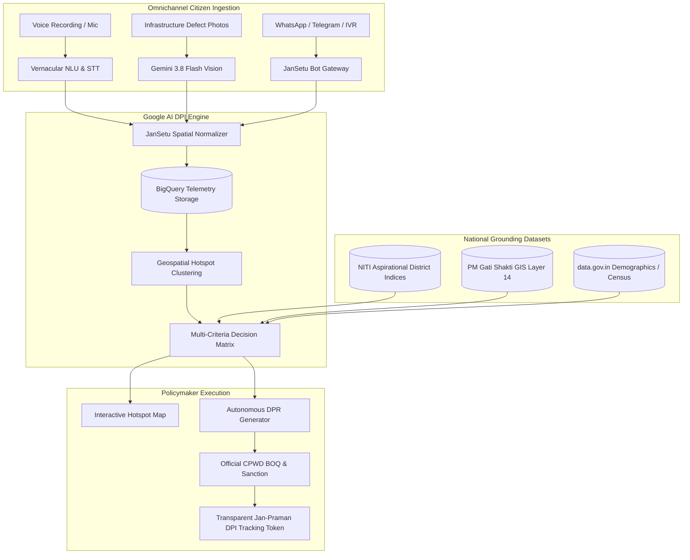

# 🇮🇳 JanSetu AI (जन-सेतु AI)
### Multilingual Digital Public Infrastructure for Demand-Driven Governance & Autonomous Infrastructure Sanctions

> **Build with AI: Code for Communities — Second Edition**  
> **Track 01:** AI for Digital Public Infrastructure & Governance (Theme: Innovation)  
> **Powered by Google AI:** Gemini 3.8 Flash, Cloud Speech & Translation, BigQuery, PM Gati Shakti GIS

---

## 📌 2-3 Line Brief Description
> **JanSetu AI** is a sovereign Digital Public Good that bridges the chasm between raw citizen suffering and national infrastructure budgets. It ingests grievances in 10+ Indian languages via voice, photo inspection (Gemini Multimodal), and WhatsApp/IVR, clusters demand hotspots against NITI Aayog and PM Gati Shakti indices, and autonomously generates official CPWD-compliant Detailed Project Reports (DPRs) to compress capital project sanctions from 9 months to under 48 hours.

---

## 🏛️ The Problem & Challenge
* **The Problem:** Governments across India struggle to consolidate citizen feedback and align it with national infrastructure priorities. Development requests live in fragmented systems, leading to misaligned public spending, unaddressed infrastructure gaps, and no way to measure the impact of large-scale digital public infrastructure initiatives.
* **The Solution:** JanSetu AI aggregates citizen development requests across diverse linguistic regions of India via **voice, text, photo, and messaging apps**. The system analyzes large datasets combining citizen feedback with national demographic data, infrastructure indices (NITI Aayog Aspirational Districts), and PM Gati Shakti National Master Plan GIS layers, surfacing demand hotspots and recommending high-priority development projects to national and state policymakers with **1-Click Autonomous Detailed Project Reports (DPRs)**.

---

## 🚀 Key Innovations & Facilities

### 1. 📢 "Jan-Vani" (Citizen Voice & Multimodal Ingestion)
- **Voice-First Ingestion:** Real-time speech-to-text recording supporting Indian vernaculars (Hindi, Bengali, Tamil, Telugu, Marathi, Kannada, Gujarati, Odia, Punjabi).
- **Gemini 3.8 Multimodal Vision Inspector:** Citizens upload photos of broken roads, water line leaks, collapsed culverts, or school roofs. Gemini AI automatically assesses structural defect type, hazard severity (1-10), public risk, and auto-classifies into central schemes (Jal Jeevan Mission, PMGSY, Ayushman Bharat, Samagra Shiksha).
- **1-Click Demo Presets:** Test instant real-world scenarios (Arsenic water rupture in UP, washed-out tribal bridge in Odisha, clinic roof collapse in Jharkhand).

### 2. 🗺️ "Shasan-Drishti" (National Geospatial Hotspot Command Center)
- **Interactive India GIS Map:** Dynamic spatial clustering with custom severity markers and pulse beacons.
- **Layer Overlays:**
  - Citizen Distress Intensity (Deficit > 85/100)
  - NITI Aayog Aspirational Districts (112 priority districts)
  - PM Gati Shakti Logistics & Rural Arterial corridor gaps
  - Funding Deficit Reconciliation (Allocated vs Required ₹ Crores)

### 3. 📑 Autonomous AI Detailed Project Report (DPR) & Allocation Engine
- **1-Click Engineering DPR Formulator:** Powered by Gemini 3.8 Flash. Generates official Ministry of Finance & CPWD-compliant proposals:
  - Technical engineering scope with IS/IRC standards
  - Financial Bill of Quantities (BOQ) with itemized costs in ₹ Lakhs
  - Central vs State share calculations
  - Demographic equity metrics (BPL, SC/ST, women time-poverty reduction)
  - PM Gati Shakti Layer 14 GIS integration
  - 12-month execution milestones
- **"Shasan-Mitra" AI Policy Copilot:** Conversational policy advisor providing scenario simulations (e.g. ₹100 Cr budget reallocations for eastern tribal districts).
- **Administrative Sanction Action:** Real-time financial clearance workflow with celebratory audit logging.

### 4. 💬 WhatsApp & IVR Citizen Bot Simulator
- Realistic mobile phone simulator showing how rural citizens interact through simple text, voice notes, and location pins on low-cost devices.
- Instant automated replies in native languages with cryptographic **"Jan-Praman"** DPI tracking tokens.

### 5. 📊 BigQuery & Open Data Analytics Console
- Live SQL query runner against simulated BigQuery telemetry datasets (`jansetu-dpi.telemetry`).
- Real-time reconciliation with `data.gov.in`, NITI Aayog Delta rankings, and GeM (Government e-Marketplace).

### 6. 🏆 Built-in 12-Slide Pitch Deck Modal
- Complete hackathon pitch presentation embedded directly into the application with interactive carousel navigation!

---

## 🏗️ Architecture & Technology Stack



### Google AI Stack Integration:
| Component | Google Technology | Role in Platform |
|---|---|---|
| **Multimodal Vision** | `gemini-3.8-flash` / `@google/genai` | Photo damage inspection, hazard index, defect categorization |
| **Voice & Speech** | Cloud Speech-to-Text / Web Speech API | Ingestion across 10+ Indian linguistic regions |
| **Policy Copilot** | `gemini-3.8-flash` | Interactive strategic advisor for Chief Ministers & District Magistrates |
| **Autonomous DPRs** | `gemini-3.8-flash` | Formulation of CPWD-compliant engineering proposals & itemized BOQ |
| **BigQuery Engine** | Google Cloud BigQuery | High-throughput aggregation of millions of citizen spatial coordinates |
| **Geospatial GIS** | Google Maps Platform / Leaflet GIS | Dynamic mapping with PM Gati Shakti Master Plan corridor layers |

---

## 🛠️ Local Development & Quick Start

### 1. Prerequisites
- Node.js (v18 or higher)
- npm or yarn

### 2. Setup
```bash
# Clone the repository
git clone https://github.com/NathN07/jansetu-dpi-platform.git
cd jansetu-dpi-platform

# Install dependencies
npm install

# Start local development server
npm run dev
```


---

## 📈 Scalability Across 28 States & 700+ Districts (Built for India)
1. **Zero Literacy Barrier:** Voice-first interaction ensures that any citizen, regardless of formal reading ability, can demand clean water, roads, or healthcare.
2. **Economic Viability:** Gemini Flash execution costs approximately **₹0.04 per grievance** and **₹0.85 per DPR**, eliminating months of consultant overhead (₹2.5 Lakhs+ per traditional DPR).
3. **Open Standards:** Built on Digital Public Good (DPG) and Beckn/ONDC open API protocols to seamlessly integrate into state CM dashboards and the National Informatics Centre (NIC) cloud.
